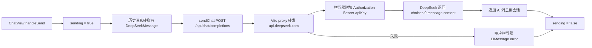

## 用户需求
为 AI 聊天应用接入 DeepSeek 大模型 API（非流式）：
1. 封装 Axios 实例，通过 Vite proxy 指向 DeepSeek API（https://api.deepseek.com）
2. 请求拦截器自动附加 `Authorization: Bearer <apiKey>`（从 auth store 读取）
3. 响应拦截器统一处理错误，用 `ElMessage.error` 提示
4. 封装 `sendChat` 函数：接收 messages 数组，返回 AI 回复文本
5. 用 Vite proxy 解决本地开发环境的 CORS 问题
6. ChatView 发送消息后调用 `sendChat`，处理 loading 状态与错误场景

## 补充说明
- 非流式请求：不带 `stream` 参数，一次性返回完整回复
- 请求携带当前会话全部历史消息作为上下文，让 AI 具备多轮对话能力
- 失败时用户消息保留在列表中，不做自动重试
- 模型默认 `deepseek-chat`，不做模型选择 UI

## 核心功能
- 开发环境请求 `/api/chat/completions`，由 Vite proxy 转发到 `https://api.deepseek.com/chat/completions`
- 登录时输入的 API Key 自动附加到每个请求的 Authorization 头
- 发送消息后输入区进入 loading 状态（禁用发送），收到回复后恢复
- API 调用失败时统一弹出错误提示，输入区恢复可用


## Tech Stack
沿用项目现有栈：
- Vue 3.5 + TypeScript + Vite 6
- axios 1.7（拦截器 + DeepSeek API 调用）
- Pinia 2.3（auth store 提供 apiKey）
- Element Plus 2.14（ElMessage 错误提示）

## Implementation Approach
### 1. Vite proxy 解决 CORS（修改 `vite.config.ts`）
- `server.proxy` 增加 `'/api'` 规则：`target: 'https://api.deepseek.com'`、`changeOrigin: true`、`rewrite` 去掉 `/api` 前缀
- 开发环境 axios baseURL 保持 `/api`，请求 `/api/chat/completions` 被代理转发到 DeepSeek，浏览器侧无跨域
- 生产环境可通过 `.env.production` 设置 `VITE_API_BASE_URL=https://api.deepseek.com` 直连（可选，本次不强制创建）

### 2. axios 实例微调（修改 `src/api/request.ts`）
- 现有拦截器已满足需求 2、3（Authorization 头 + ElMessage 错误提示），保持不动
- 超时从 15000ms 调大到 60000ms：AI 生成响应较慢，避免非流式长回复被误杀
- 响应错误分支补充对 HTTP 401 的友好提示（API Key 无效），引导用户检查或重新登录

### 3. sendChat 封装（重写 `src/api/chat.ts`）
- 定义 DeepSeek 协议类型：`DeepSeekMessage { role: 'user' | 'assistant' | 'system'; content: string }`、`DeepSeekChatResponse`（取 `choices[0].message.content`）
- `sendChat(messages: DeepSeekMessage[], options?: { model?: string })`：POST `/chat/completions`，body 为 `{ model: 'deepseek-chat', messages }`，返回 `Promise<string>`
- model 默认 `deepseek-chat`，参数可覆盖（预留 `deepseek-reasoner` 扩展）
- 提供转换函数：项目内 `ChatMessage[]` → `DeepSeekMessage[]`（剔除 id/timestamp，只保留 role + content）

### 4. ChatView 接入真实 API（修改 `src/views/ChatView.vue`）
- `handleSend`：追加用户消息 → `sending = true` → 将当前会话全部历史消息转换为 DeepSeek 格式 → `await sendChat(...)` → 追加 AI 回复消息 → `finally` 中恢复 `sending = false`
- 错误处理：拦截器已统一 `ElMessage.error` 提示，ChatView 捕获异常后仅恢复状态；用户消息保留，可修改后重发
- `sending` 传入 ChatInput 的 `disabled` prop，复用现有 loading 按钮表现（Enter 发送也被 canSend 计算属性禁用）
- 移除 setTimeout 模拟回复代码与 TODO 注释
- 顺手优化：新会话发送首条消息后，将会话标题更新为消息前 20 字（mock 数据会话标题不受影响）

## Implementation Notes
- `useAuthStore()` 必须在拦截器回调函数内部调用（延续现有写法，避免在模块加载期访问 Pinia）
- Vite proxy 的 `rewrite` 使用 `(path) => path.replace(/^\/api/, '')`，确保路径正确
- 非流式请求无逐字渲染，ChatWindow 已有 `watch(messages.length)` 自动滚动到底部，无需改动
- 请求超时 60s 是非流式的必要妥协；后续做流式（SSE）时可缩短
- 生产直连 DeepSeek 存在 CORS 限制（浏览器直调第三方 API），本次以开发代理为主，生产部署方案（自建网关或代理）留待后续

## Architecture（数据流）


## Directory Structure
```
e:/projects/ai-chat-agent/
├── vite.config.ts               # [MODIFY] server.proxy 增加 '/api' 代理到 https://api.deepseek.com，rewrite 去前缀
├── src/
│   ├── api/
│   │   ├── request.ts           # [MODIFY] timeout 调大到 60000ms；响应拦截器补充 401 友好提示
│   │   └── chat.ts              # [REWRITE] DeepSeek 协议类型定义；sendChat 函数；ChatMessage → DeepSeekMessage 转换
│   └── views/
│       └── ChatView.vue         # [MODIFY] handleSend 改为调用 sendChat；新增 sending 状态传给 ChatInput；移除模拟回复；新会话首条消息更新标题
```

## Key Code Structures
```ts
// src/api/chat.ts
export interface DeepSeekMessage {
  role: 'user' | 'assistant' | 'system'
  content: string
}

export interface SendChatOptions {
  model?: string // 默认 'deepseek-chat'
}

export function toDeepSeekMessages(messages: ChatMessage[]): DeepSeekMessage[]
export async function sendChat(
  messages: DeepSeekMessage[],
  options?: SendChatOptions,
): Promise<string> // 返回 choices[0].message.content
```

