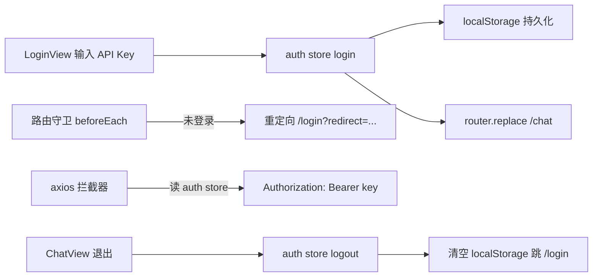

## 用户需求
为 AI 聊天应用实现登录功能：
1. 新增登录页，用户输入 API Key，登录状态存入 Pinia store 并持久化到 localStorage
2. 路由守卫检查登录状态，未登录访问受保护页面时重定向到 /login
3. 登录成功后跳转到 /chat 页面

## 补充说明
- API Key 仅做本地非空校验（当前无后端校验接口）
- 已登录用户访问 /login 时自动跳转 /chat，避免重复登录
- 退出登录：清除 Pinia 状态与 localStorage，并跳回 /login
- API Key 自动附加到后续 axios 请求的 Authorization 头，为聊天接口做准备
- 保留现有 HomeView / AboutView，不做无关改动

## 核心功能
- 登录页：API Key 输入框（密码模式可切换明文）、非空校验、登录提交
- 认证状态管理：Pinia store + localStorage 双写，刷新页面不丢失登录态
- 路由守卫：未登录访问 /chat 跳 /login（携带 redirect 参数），已登录访问 /login 跳 /chat
- 聊天页占位：显示登录状态与退出按钮，后续迭代实现聊天功能


## 技术栈
沿用项目现有栈（已在 package.json 确认）：
- Vue 3.5 + TypeScript + Vite 6
- Pinia 2.3（状态管理）
- vue-router 4.5（路由 + 全局守卫）
- Element Plus 2.14（登录表单 UI）
- axios 1.7（请求拦截器附加凭证）

## 实现方案
### 1. 认证 Store（新增 `src/stores/auth.ts`）
- `state.apiKey`：初始值从 `localStorage.getItem('ai_chat_api_key')` 读取，实现刷新恢复
- `login(key: string)`：非空校验（trim 后不得为空）→ 写 state + localStorage
- `logout()`：清空 state + 移除 localStorage 键
- `isAuthenticated` getter：`apiKey` 非空即视为已登录
- 导出常量 `API_KEY_STORAGE_KEY` 统一管理存储键名，避免魔法字符串

### 2. 路由与守卫（修改 `src/router/index.ts`）
- 新增路由：`/login` → LoginView、`/chat` → ChatView（均懒加载，与现有路由写法一致）
- `/chat` 标记 `meta: { requiresAuth: true }`
- `router.beforeEach` 全局守卫：
  - 未登录访问 requiresAuth 路由 → `next({ path: '/login', query: { redirect: to.fullPath } })`
  - 已登录访问 `/login` → `next('/chat')`
  - 其余放行
- 守卫内使用 `useAuthStore()`（传入 pinia 实例或依赖已注册的 pinia，router 在 main.ts 中于 pinia 之后 use，安全）
- 404 路由保持重定向 `/`，不额外改动

### 3. 登录页（新增 `src/views/LoginView.vue`）
- Element Plus 表单：`el-input` type=password + show-password 切换明文
- el-form rules 非空校验，Enter 键提交
- 提交流程：校验 → `auth.login(key)` → `ElMessage.success` → `router.replace(redirect || '/chat')`（支持守卫携带的 redirect 回跳）
- 页面为独立全屏布局，不依赖 App.vue 现有结构

### 4. 聊天页占位（新增 `src/views/ChatView.vue`）
- 顶栏显示“已登录”状态 + 退出按钮
- 退出：`auth.logout()` → `router.replace('/login')`
- 中部留占位区域，后续迭代实现聊天

### 5. 请求凭证注入（修改 `src/api/request.ts`）
- 请求拦截器中读取 API Key（通过导入 auth store 或直接读 localStorage，采用 store 方式保持单一数据源），存在时附加 `Authorization: Bearer <key>`
- 复用现有拦截器结构，替换原注释占位代码

## 性能与可靠性
- 路由懒加载，登录页/聊天页按需加载，不影响首屏
- 守卫为纯同步判断（读 store state），无异步开销
- localStorage 读写仅在登录/登出/初始化时发生，无热路径问题
- 存储 key 统一常量，避免不一致导致登录态判断失效

## 架构（数据流）


## 目录结构
```
e:/projects/ai-chat-agent/
├── src/
│   ├── stores/
│   │   └── auth.ts            # [NEW] 认证 store：apiKey 状态、login/logout、isAuthenticated、存储 key 常量
│   ├── views/
│   │   ├── LoginView.vue      # [NEW] 登录页：API Key 表单、非空校验、提交登录并跳转
│   │   └── ChatView.vue       # [NEW] 聊天占位页：登录状态展示、退出登录按钮
│   ├── router/
│   │   └── index.ts           # [MODIFY] 新增 /login、/chat 路由；meta.requiresAuth；beforeEach 全局守卫
│   └── api/
│       └── request.ts         # [MODIFY] 请求拦截器附加 Authorization: Bearer <apiKey>
```


## 设计说明
登录页采用居中卡片式全屏布局，深色渐变背景（深蓝到深紫微渐变）营造科技感；中央为白色圆角卡片（含阴影），顶部为应用 Logo 图标与应用名，中部为“API Key”标题、说明文字与密码输入框（支持明文切换），底部为全宽主色登录按钮（hover 微上浮效果）。整体风格与 Element Plus 组件体系一致，简洁克制，无多余元素。聊天页顶栏为浅色工具条：左侧应用名，右侧登录状态标签与退出按钮；主体为空态占位区域，为后续聊天界面预留。

## 页面结构
### LoginView
- 顶部区块：Logo 图标 + 应用名称 + 副标题说明
- 表单区块：API Key 密码输入框（可切换明文）+ 非空校验提示
- 操作区块：全宽主按钮“登录”，Enter 快捷提交
### ChatView
- 顶栏：应用名（左）+ 已登录状态标签 + 退出按钮（右）
- 主体：空态占位（图标 + “聊天功能开发中”提示文案）
